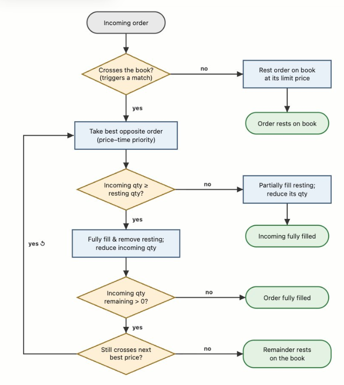

# cpp-trading-exchange

A high-performance trading exchange engine written in C++26.

The exchange implements core matching-engine components: order intake, a price-time-priority matching algorithm, and
market-data dissemination — built with low-latency primitives (lock-free queues, memory pools, RDTSC timing).

## Quick start

```bash
bazel build //...   # build everything
bazel test //...    # run all tests
```

See [BAZEL_BUILD.md](BAZEL_BUILD.md) for full build instructions, available targets, and compiler flags.

## Project layout

```
common/      # shared low-latency utilities (lock-free queue, memory pool, logging)
exchange/
  matcher/        # price-time-priority matching engine
  order_server/   # order intake and session management
  market_data/    # market-data feed handler
examples/    # standalone benchmarks and demos
```

## Development environment setup

### Issues

1. Had to upgrade to minimum Ubuntu 22.04 LTS to install gcc-14 and g++-14 in order to run c++26.
2. Conda/Miniconda was preventing GLIBCXX_3.4.32 from being found. Had to disable with

```bash
conda deactivate
unset LD_LIBRARY_PATH
hash -r
```

## Week 1

Benchmark results:

```
INFO: Running command line: bazel-bin/examples/container_benchmark

=== Container Benchmark (N=100) ===

  Insert (total cycles)         vector:     9030   map:   183820   unordered_map:   157395  cycles
  Lookup (avg cycles/op)        vector:      442   map:      431   unordered_map:      186  cycles
  Lookup cold (avg cycles/op)   vector:     7589   map:     9264   unordered_map:     7783  cycles
  Iterate (total cycles)        vector:     2870   map:    13265   unordered_map:     6685  cycles

=== Container Benchmark (N=100000) ===

  Insert (total cycles)         vector: 10415615   map: 171017700   unordered_map: 56561400  cycles
  Lookup (avg cycles/op)        vector:      932   map:     1127   unordered_map:      280  cycles
  Lookup cold (avg cycles/op)   vector:    13107   map:    19879   unordered_map:    10316  cycles
  Iterate (total cycles)        vector:  2028740   map:  7790580   unordered_map:  5051375  cycles


=== Container Benchmark (N=10000000) ===

  Insert (total cycles)         vector: 1114309455   map: 23671997720   unordered_map: 6374298630  cycles
  Lookup (avg cycles/op)        vector:     2955   map:     9997   unordered_map:     1180  cycles
  Lookup cold (avg cycles/op)   vector:    20953   map:    35111   unordered_map:    13223  cycles
  Iterate (total cycles)        vector: 205914345   map: 884257640   unordered_map: 480204130  cycles

Notes:
  - vector lookup uses binary search (O(log N)), same asymptotic cost as map.
  - vector iteration is a contiguous memory scan — maximally cache-friendly.
  - map nodes are heap-allocated individually; each traversal step risks a cache miss.
  - unordered_map is pre-sized (reserve) to avoid rehashing penalty.
  - 'Lookup cold' evicts the cache (64 MB buffer scan) before each probe so
    the lookup pays the cost of refetching from memory; sampled over 256 keys.
  - at small N, timings are dominated by rdtsc overhead and quantization.
  - sink=600068103923820 (prevents dead-code elimination)
```

## Week 2

Implement memory pool function. See: Memory Pool - API

- Eliminate heap allocation at runtime (pre-allocate everything upfront)
- Keep hot objects cache-local in a contiguous vector
- Avoid any per-allocation overhead

- Write test cases
    - Serving a mempool with integers
    - Ensure that allocate/deallocate works
- Use the second design choice, but if time permits, benchmark performance
  with two different data structures. Log time from start to end and see if
  it's different with the different implementations.

Run tests with:

```bash
bazel test //project/tests:mem_pool_test --test_output=all
```

Repurposed `container_benchmark.cpp` to compare the two versions of the MemPool.

```bash
bazel run project:mem_pool_benchmark

=== MemPool Benchmark (N=100) ===

  Allocate N (total)                    MemPool:        917   new/delete:      24042   malloc/free:       1833  cycles
  Deallocate N (total)                  MemPool:        458   new/delete:       3393   malloc/free:        959  cycles
  Dealloc random order (total)          MemPool:        708   new/delete:       1208   malloc/free:       1208  cycles
  Alloc cold (avg cycles/op)            MemPool:         57   new/delete:        724   malloc/free:        470  cycles
  Churn N ops (total)                   MemPool:      11393   new/delete:       8209   malloc/free:       8250  cycles

=== MemPool Benchmark (N=100000) ===

  Allocate N (total)                    MemPool:     789582   new/delete:     961962   malloc/free:     610394  cycles
  Deallocate N (total)                  MemPool:     446371   new/delete:     872302   malloc/free:     746314  cycles
  Dealloc random order (total)          MemPool:     861659   new/delete:    1050805   malloc/free:     983313  cycles
  Alloc cold (avg cycles/op)            MemPool:         53   new/delete:        392   malloc/free:        332  cycles
  Churn N ops (total)                   MemPool:    7600002   new/delete:    7817417   malloc/free:    7520533  cycles

=== MemPool Benchmark (N=1000000) ===

  Allocate N (total)                    MemPool:    8084033   new/delete:    7173339   malloc/free:    7414522  cycles
  Deallocate N (total)                  MemPool:    4591363   new/delete:    8840181   malloc/free:    8448577  cycles
  Dealloc random order (total)          MemPool:   38980114   new/delete:   55219900   malloc/free:   57812834  cycles
  Alloc cold (avg cycles/op)            MemPool:         54   new/delete:        494   malloc/free:        386  cycles
  Churn N ops (total)                   MemPool:   93546936   new/delete:  108036018   malloc/free:  130736929  cycles

Notes:
  - MemPool pre-allocates all slots in a contiguous vector — zero system-allocator calls.
  - new/delete and malloc/free go through the system allocator on every call.
  - 'Alloc cold' evicts the cache (64 MB buffer scan) before each allocation;
    sampled over 256 operations.
  - 'Churn' randomly interleaves allocations and deallocations at ~50% occupancy.
  - Object type: Order (4 x uint64_t = 32 bytes), representative of an order book entry.
  - sink=3468889619391 (prevents dead-code elimination)

```

```bash
bazel run project:mem_pool_separate_free_structure_benchmark

=== MemPoolSeparateFreeStructure Benchmark (N=100) ===

  Allocate N (total)                    MemPool:        917   new/delete:      14333   malloc/free:       1542  cycles
  Deallocate N (total)                  MemPool:        375   new/delete:       3000   malloc/free:        916  cycles
  Dealloc random order (total)          MemPool:        584   new/delete:       1125   malloc/free:       1209  cycles
  Alloc cold (avg cycles/op)            MemPool:         39   new/delete:        588   malloc/free:        307  cycles
  Churn N ops (total)                   MemPool:       7768   new/delete:       8125   malloc/free:       8958  cycles

=== MemPoolSeparateFreeStructure Benchmark (N=100000) ===

  Allocate N (total)                    MemPool:     784855   new/delete:     920028   malloc/free:     918653  cycles
  Deallocate N (total)                  MemPool:     398771   new/delete:     822766   malloc/free:     792582  cycles
  Dealloc random order (total)          MemPool:     955502   new/delete:    1052639   malloc/free:    1045388  cycles
  Alloc cold (avg cycles/op)            MemPool:         37   new/delete:        389   malloc/free:        291  cycles
  Churn N ops (total)                   MemPool:    7699222   new/delete:    7864077   malloc/free:    7401088  cycles

=== MemPoolSeparateFreeStructure Benchmark (N=1000000) ===

  Allocate N (total)                    MemPool:    7354861   new/delete:    7298785   malloc/free:    7523199  cycles
  Deallocate N (total)                  MemPool:    4000095   new/delete:    9213891   malloc/free:    8172128  cycles
  Dealloc random order (total)          MemPool:   38607944   new/delete:   44921083   malloc/free:   56866873  cycles
  Alloc cold (avg cycles/op)            MemPool:         33   new/delete:        222   malloc/free:        467  cycles
  Churn N ops (total)                   MemPool:  102881548   new/delete:  111250549   malloc/free:  105409422  cycles

Notes:
  - MemPoolSeparateFreeStructure pre-allocates all slots in a contiguous vector —
    zero system-allocator calls. The free-list index is stored in a separate field
    alongside (but outside) the object storage.
  - new/delete and malloc/free go through the system allocator on every call.
  - 'Alloc cold' evicts the cache (64 MB buffer scan) before each allocation;
    sampled over 256 operations.
  - 'Churn' randomly interleaves allocations and deallocations at ~50% occupancy.
  - Object type: Order (4 x uint64_t = 32 bytes), representative of an order book entry.
  - sink=3468889619391 (prevents dead-code elimination)
```

# Week 3



Implemented the core `OrderBook` logic and matching engine:

- **Order Management**: Added functionality to add and cancel orders using a `MemPool` for high-performance allocation.
- **Matching Engine**: Implemented price-time priority matching for Bid and Ask orders.
- **Price Levels**: Used `IntrusiveQueue`, a doubly-linked list for O(1) order insertion and removal within a price
  level.
- **Data Structures**: Leveraged `std::map` to maintain sorted price levels for efficient best-price discovery.
- **Testing**: Added comprehensive unit tests for order matching, cancellation, and book state validation.

Sample output of 100 orders added:

```
INFO: Running command line: bazel-bin/project/entrypoint
[2026-06-29 16:30:09.006] [info] Initializing the Order Book
[2026-06-29 16:30:09.006] [info] (Incoming): Ask, Market: AAPL, 25.000 @ $151.00 [id: 1]
[2026-06-29 16:30:09.006] [info] (Resting): Ask, Market: AAPL, 25.000 @ $151.00 [id: 1]
[2026-06-29 16:30:09.006] [info] (Incoming): Ask, Limit: AAPL, 38.000 @ $149.00 [id: 2]
[2026-06-29 16:30:09.006] [info] (Resting): Ask, Limit: AAPL, 38.000 @ $149.00 [id: 2]
[2026-06-29 16:30:09.006] [info] (Cancelled): Ask, Limit: AAPL, 38.000 @ $149.00 [id: 2]
[2026-06-29 16:30:09.006] [info] (Incoming): Bid, Market: AAPL, 94.000 @ $151.00 [id: 3]
[2026-06-29 16:30:09.006] [info] (Matched 25.000 with): Ask, Market: AAPL, 0.000 @ $151.00 [id: 1]
[2026-06-29 16:30:09.006] [info] (Closing): Ask, Market: AAPL, 0.000 @ $151.00 [id: 1]
[2026-06-29 16:30:09.006] [info] (Resting): Bid, Market: AAPL, 69.000 @ $151.00 [id: 3]
[2026-06-29 16:30:09.006] [info] (Incoming): Bid, Limit: AAPL, 0.250 @ $151.00 [id: 4]
[2026-06-29 16:30:09.006] [info] (Resting): Bid, Limit: AAPL, 0.250 @ $151.00 [id: 4]
[2026-06-29 16:30:09.006] [info] (Incoming): Ask, Limit: AAPL, 0.750 @ $153.42 [id: 5]
[2026-06-29 16:30:09.006] [info] (Resting): Ask, Limit: AAPL, 0.750 @ $153.42 [id: 5]
[2026-06-29 16:30:09.006] [info] (Incoming): Ask, Market: AAPL, 40.000 @ $152.00 [id: 6]
[2026-06-29 16:30:09.006] [info] (Matched 40.000 with): Bid, Market: AAPL, 29.000 @ $151.00 [id: 3]
[2026-06-29 16:30:09.006] [info] (Fully Matched): Ask, Market: AAPL, 0.000 @ $152.00 [id: 6]
[2026-06-29 16:30:09.006] [info] (Cancelled): Bid, Market: AAPL, 29.000 @ $151.00 [id: 3]
[2026-06-29 16:30:09.006] [info] (Incoming): Bid, Limit: AAPL, 0.500 @ $150.00 [id: 7]
[2026-06-29 16:30:09.006] [info] (Resting): Bid, Limit: AAPL, 0.500 @ $150.00 [id: 7]
[2026-06-29 16:30:09.006] [info] (Incoming): Bid, Limit: AAPL, 80.000 @ $148.00 [id: 8]
[2026-06-29 16:30:09.006] [info] (Resting): Bid, Limit: AAPL, 80.000 @ $148.00 [id: 8]
[2026-06-29 16:30:09.006] [info] (Incoming): Bid, Market: AAPL, 69.000 @ $146.00 [id: 9]
[2026-06-29 16:30:09.006] [info] (Matched 0.750 with): Ask, Limit: AAPL, 0.000 @ $153.42 [id: 5]
[2026-06-29 16:30:09.006] [info] (Closing): Ask, Limit: AAPL, 0.000 @ $153.42 [id: 5]
[2026-06-29 16:30:09.006] [info] (Resting): Bid, Market: AAPL, 68.250 @ $146.00 [id: 9]
[2026-06-29 16:30:09.006] [info] (Incoming): Ask, Limit: AAPL, 86.000 @ $144.00 [id: 10]
[2026-06-29 16:30:09.006] [info] (Matched 0.250 with): Bid, Limit: AAPL, 0.000 @ $151.00 [id: 4]
[2026-06-29 16:30:09.006] [info] (Closing): Bid, Limit: AAPL, 0.000 @ $151.00 [id: 4]
[2026-06-29 16:30:09.006] [info] (Matched 0.500 with): Bid, Limit: AAPL, 0.000 @ $150.00 [id: 7]
[2026-06-29 16:30:09.006] [info] (Closing): Bid, Limit: AAPL, 0.000 @ $150.00 [id: 7]
[2026-06-29 16:30:09.006] [info] (Matched 80.000 with): Bid, Limit: AAPL, 0.000 @ $148.00 [id: 8]
[2026-06-29 16:30:09.006] [info] (Closing): Bid, Limit: AAPL, 0.000 @ $148.00 [id: 8]
[2026-06-29 16:30:09.006] [info] (Matched 5.250 with): Bid, Market: AAPL, 63.000 @ $146.00 [id: 9]
[2026-06-29 16:30:09.006] [info] (Fully Matched): Ask, Limit: AAPL, 0.000 @ $144.00 [id: 10]
[2026-06-29 16:30:09.006] [info] (Incoming): Bid, Limit: AAPL, 59.000 @ $141.00 [id: 11]
[2026-06-29 16:30:09.006] [info] (Resting): Bid, Limit: AAPL, 59.000 @ $141.00 [id: 11]
[2026-06-29 16:30:09.006] [info] (Incoming): Ask, Market: AAPL, 0.500 @ $141.00 [id: 12]
[2026-06-29 16:30:09.006] [info] (Matched 0.500 with): Bid, Market: AAPL, 62.500 @ $146.00 [id: 9]
[2026-06-29 16:30:09.006] [info] (Fully Matched): Ask, Market: AAPL, 0.000 @ $141.00 [id: 12]
[2026-06-29 16:30:09.006] [info] (Incoming): Ask, Market: AAPL, 24.000 @ $139.00 [id: 13]
[2026-06-29 16:30:09.006] [info] (Matched 24.000 with): Bid, Market: AAPL, 38.500 @ $146.00 [id: 9]
[2026-06-29 16:30:09.006] [info] (Fully Matched): Ask, Market: AAPL, 0.000 @ $139.00 [id: 13]
[2026-06-29 16:30:09.006] [info] (Incoming): Bid, Market: AAPL, 88.000 @ $139.00 [id: 14]
[2026-06-29 16:30:09.006] [info] (Resting): Bid, Market: AAPL, 88.000 @ $139.00 [id: 14]
[2026-06-29 16:30:09.006] [info] (Cancelled): Bid, Market: AAPL, 38.500 @ $146.00 [id: 9]
[2026-06-29 16:30:09.006] [info] (Incoming): Bid, Limit: AAPL, 5.000 @ $137.21 [id: 15]
[2026-06-29 16:30:09.006] [info] (Resting): Bid, Limit: AAPL, 5.000 @ $137.21 [id: 15]
[2026-06-29 16:30:09.006] [info] (Incoming): Ask, Limit: AAPL, 13.000 @ $135.00 [id: 16]
[2026-06-29 16:30:09.006] [info] (Matched 13.000 with): Bid, Limit: AAPL, 46.000 @ $141.00 [id: 11]
[2026-06-29 16:30:09.006] [info] (Fully Matched): Ask, Limit: AAPL, 0.000 @ $135.00 [id: 16]
[2026-06-29 16:30:09.006] [info] (Incoming): Bid, Market: AAPL, 85.000 @ $136.00 [id: 17]
[2026-06-29 16:30:09.006] [info] (Resting): Bid, Market: AAPL, 85.000 @ $136.00 [id: 17]
[2026-06-29 16:30:09.006] [info] (Incoming): Ask, Limit: AAPL, 94.000 @ $135.00 [id: 18]
[2026-06-29 16:30:09.006] [info] (Matched 46.000 with): Bid, Limit: AAPL, 0.000 @ $141.00 [id: 11]
[2026-06-29 16:30:09.006] [info] (Closing): Bid, Limit: AAPL, 0.000 @ $141.00 [id: 11]
[2026-06-29 16:30:09.006] [info] (Matched 48.000 with): Bid, Market: AAPL, 40.000 @ $139.00 [id: 14]
[2026-06-29 16:30:09.006] [info] (Fully Matched): Ask, Limit: AAPL, 0.000 @ $135.00 [id: 18]
[2026-06-29 16:30:09.006] [info] (Incoming): Bid, Market: AAPL, 53.000 @ $135.00 [id: 19]
[2026-06-29 16:30:09.006] [info] (Resting): Bid, Market: AAPL, 53.000 @ $135.00 [id: 19]
[2026-06-29 16:30:09.006] [info] (Incoming): Ask, Market: AAPL, 78.000 @ $135.00 [id: 20]
[2026-06-29 16:30:09.006] [info] (Matched 40.000 with): Bid, Market: AAPL, 0.000 @ $139.00 [id: 14]
[2026-06-29 16:30:09.006] [info] (Closing): Bid, Market: AAPL, 0.000 @ $139.00 [id: 14]
[2026-06-29 16:30:09.006] [info] (Matched 5.000 with): Bid, Limit: AAPL, 0.000 @ $137.21 [id: 15]
[2026-06-29 16:30:09.006] [info] (Closing): Bid, Limit: AAPL, 0.000 @ $137.21 [id: 15]
[2026-06-29 16:30:09.006] [info] (Matched 33.000 with): Bid, Market: AAPL, 52.000 @ $136.00 [id: 17]
[2026-06-29 16:30:09.006] [info] (Fully Matched): Ask, Market: AAPL, 0.000 @ $135.00 [id: 20]
[2026-06-29 16:30:09.006] [info] (Incoming): Ask, Market: AAPL, 73.000 @ $136.00 [id: 21]
[2026-06-29 16:30:09.006] [info] (Matched 52.000 with): Bid, Market: AAPL, 0.000 @ $136.00 [id: 17]
[2026-06-29 16:30:09.006] [info] (Closing): Bid, Market: AAPL, 0.000 @ $136.00 [id: 17]
[2026-06-29 16:30:09.006] [info] (Matched 21.000 with): Bid, Market: AAPL, 32.000 @ $135.00 [id: 19]
[2026-06-29 16:30:09.006] [info] (Fully Matched): Ask, Market: AAPL, 0.000 @ $136.00 [id: 21]
[2026-06-29 16:30:09.006] [info] (Incoming): Ask, Limit: AAPL, 70.000 @ $136.00 [id: 22]
[2026-06-29 16:30:09.006] [info] (Resting): Ask, Limit: AAPL, 70.000 @ $136.00 [id: 22]
[2026-06-29 16:30:09.006] [info] (Incoming): Bid, Market: AAPL, 63.000 @ $134.66 [id: 23]
[2026-06-29 16:30:09.006] [info] (Matched 63.000 with): Ask, Limit: AAPL, 7.000 @ $136.00 [id: 22]
[2026-06-29 16:30:09.006] [info] (Fully Matched): Bid, Market: AAPL, 0.000 @ $134.66 [id: 23]
[2026-06-29 16:30:09.006] [info] (Incoming): Bid, Limit: AAPL, 30.000 @ $133.00 [id: 24]
[2026-06-29 16:30:09.006] [info] (Resting): Bid, Limit: AAPL, 30.000 @ $133.00 [id: 24]
[2026-06-29 16:30:09.006] [info] (Incoming): Bid, Market: AAPL, 18.000 @ $131.04 [id: 25]
[2026-06-29 16:30:09.006] [info] (Matched 7.000 with): Ask, Limit: AAPL, 0.000 @ $136.00 [id: 22]
[2026-06-29 16:30:09.006] [info] (Closing): Ask, Limit: AAPL, 0.000 @ $136.00 [id: 22]
[2026-06-29 16:30:09.006] [info] (Resting): Bid, Market: AAPL, 11.000 @ $131.04 [id: 25]
[2026-06-29 16:30:09.006] [info] (Incoming): Bid, Market: AAPL, 58.000 @ $133.00 [id: 26]
[2026-06-29 16:30:09.006] [info] (Resting): Bid, Market: AAPL, 58.000 @ $133.00 [id: 26]
[2026-06-29 16:30:09.006] [info] (Cancelled): Bid, Market: AAPL, 11.000 @ $131.04 [id: 25]
[2026-06-29 16:30:09.006] [info] (Incoming): Bid, Limit: AAPL, 46.000 @ $136.00 [id: 27]
[2026-06-29 16:30:09.006] [info] (Resting): Bid, Limit: AAPL, 46.000 @ $136.00 [id: 27]
[2026-06-29 16:30:09.006] [info] (Incoming): Ask, Market: AAPL, 42.000 @ $135.00 [id: 28]
[2026-06-29 16:30:09.006] [info] (Matched 42.000 with): Bid, Limit: AAPL, 4.000 @ $136.00 [id: 27]
[2026-06-29 16:30:09.006] [info] (Fully Matched): Ask, Market: AAPL, 0.000 @ $135.00 [id: 28]
[2026-06-29 16:30:09.006] [info] (Incoming): Ask, Limit: AAPL, 24.000 @ $135.00 [id: 29]
[2026-06-29 16:30:09.006] [info] (Matched 4.000 with): Bid, Limit: AAPL, 0.000 @ $136.00 [id: 27]
[2026-06-29 16:30:09.006] [info] (Closing): Bid, Limit: AAPL, 0.000 @ $136.00 [id: 27]
[2026-06-29 16:30:09.006] [info] (Matched 20.000 with): Bid, Market: AAPL, 12.000 @ $135.00 [id: 19]
[2026-06-29 16:30:09.006] [info] (Fully Matched): Ask, Limit: AAPL, 0.000 @ $135.00 [id: 29]
[2026-06-29 16:30:09.006] [info] (Incoming): Ask, Market: AAPL, 56.000 @ $136.00 [id: 30]
[2026-06-29 16:30:09.006] [info] (Matched 12.000 with): Bid, Market: AAPL, 0.000 @ $135.00 [id: 19]
[2026-06-29 16:30:09.006] [info] (Closing): Bid, Market: AAPL, 0.000 @ $135.00 [id: 19]
[2026-06-29 16:30:09.006] [info] (Matched 30.000 with): Bid, Limit: AAPL, 0.000 @ $133.00 [id: 24]
[2026-06-29 16:30:09.006] [info] (Closing): Bid, Limit: AAPL, 0.000 @ $133.00 [id: 24]
[2026-06-29 16:30:09.006] [info] (Matched 14.000 with): Bid, Market: AAPL, 44.000 @ $133.00 [id: 26]
[2026-06-29 16:30:09.006] [info] (Fully Matched): Ask, Market: AAPL, 0.000 @ $136.00 [id: 30]
[2026-06-29 16:30:09.006] [info] (Incoming): Ask, Limit: AAPL, 59.000 @ $173.00 [id: 31]
[2026-06-29 16:30:09.006] [info] (Resting): Ask, Limit: AAPL, 59.000 @ $173.00 [id: 31]
[2026-06-29 16:30:09.006] [info] (Cancelled): Bid, Market: AAPL, 44.000 @ $133.00 [id: 26]
[2026-06-29 16:30:09.006] [info] (Incoming): Bid, Market: AAPL, 16.000 @ $157.00 [id: 32]
[2026-06-29 16:30:09.006] [info] (Matched 16.000 with): Ask, Limit: AAPL, 43.000 @ $173.00 [id: 31]
[2026-06-29 16:30:09.006] [info] (Fully Matched): Bid, Market: AAPL, 0.000 @ $157.00 [id: 32]
[2026-06-29 16:30:09.006] [info] (Incoming): Bid, Limit: AAPL, 46.000 @ $156.00 [id: 33]
[2026-06-29 16:30:09.006] [info] (Resting): Bid, Limit: AAPL, 46.000 @ $156.00 [id: 33]
[2026-06-29 16:30:09.006] [info] (Cancelled): Bid, Limit: AAPL, 46.000 @ $156.00 [id: 33]
[2026-06-29 16:30:09.006] [info] (Incoming): Ask, Market: AAPL, 94.000 @ $154.00 [id: 34]
[2026-06-29 16:30:09.006] [info] (Resting): Ask, Market: AAPL, 94.000 @ $154.00 [id: 34]
[2026-06-29 16:30:09.006] [info] (Cancelled): Ask, Market: AAPL, 94.000 @ $154.00 [id: 34]
[2026-06-29 16:30:09.006] [info] (Incoming): Bid, Limit: AAPL, 5.000 @ $156.00 [id: 35]
[2026-06-29 16:30:09.006] [info] (Resting): Bid, Limit: AAPL, 5.000 @ $156.00 [id: 35]
[2026-06-29 16:30:09.006] [info] (Cancelled): Bid, Limit: AAPL, 5.000 @ $156.00 [id: 35]
[2026-06-29 16:30:09.006] [info] (Incoming): Bid, Limit: AAPL, 78.000 @ $123.00 [id: 36]
[2026-06-29 16:30:09.006] [info] (Resting): Bid, Limit: AAPL, 78.000 @ $123.00 [id: 36]
[2026-06-29 16:30:09.006] [info] (Incoming): Ask, Market: AAPL, 52.000 @ $126.00 [id: 37]
[2026-06-29 16:30:09.006] [info] (Matched 52.000 with): Bid, Limit: AAPL, 26.000 @ $123.00 [id: 36]
[2026-06-29 16:30:09.006] [info] (Fully Matched): Ask, Market: AAPL, 0.000 @ $126.00 [id: 37]
[2026-06-29 16:30:09.006] [info] (Incoming): Ask, Limit: AAPL, 84.000 @ $127.00 [id: 38]
[2026-06-29 16:30:09.006] [info] (Resting): Ask, Limit: AAPL, 84.000 @ $127.00 [id: 38]
[2026-06-29 16:30:09.006] [info] (Incoming): Ask, Market: AAPL, 26.000 @ $126.00 [id: 39]
[2026-06-29 16:30:09.006] [info] (Matched 26.000 with): Bid, Limit: AAPL, 0.000 @ $123.00 [id: 36]
[2026-06-29 16:30:09.006] [info] (Closing): Bid, Limit: AAPL, 0.000 @ $123.00 [id: 36]
[2026-06-29 16:30:09.006] [info] (Fully Matched): Ask, Market: AAPL, 0.000 @ $126.00 [id: 39]
[2026-06-29 16:30:09.006] [info] (Incoming): Bid, Market: AAPL, 30.000 @ $127.00 [id: 40]
[2026-06-29 16:30:09.006] [info] (Matched 30.000 with): Ask, Limit: AAPL, 54.000 @ $127.00 [id: 38]
[2026-06-29 16:30:09.006] [info] (Fully Matched): Bid, Market: AAPL, 0.000 @ $127.00 [id: 40]
[2026-06-29 16:30:09.006] [info] (Incoming): Ask, Market: AAPL, 59.000 @ $126.00 [id: 41]
[2026-06-29 16:30:09.006] [info] (Resting): Ask, Market: AAPL, 59.000 @ $126.00 [id: 41]
[2026-06-29 16:30:09.006] [info] (Incoming): Ask, Market: AAPL, 86.000 @ $199.00 [id: 42]
[2026-06-29 16:30:09.006] [info] (Resting): Ask, Market: AAPL, 86.000 @ $199.00 [id: 42]
[2026-06-29 16:30:09.006] [info] (Incoming): Bid, Market: AAPL, 62.000 @ $144.00 [id: 43]
[2026-06-29 16:30:09.006] [info] (Matched 59.000 with): Ask, Market: AAPL, 0.000 @ $126.00 [id: 41]
[2026-06-29 16:30:09.006] [info] (Closing): Ask, Market: AAPL, 0.000 @ $126.00 [id: 41]
[2026-06-29 16:30:09.006] [info] (Matched 3.000 with): Ask, Limit: AAPL, 51.000 @ $127.00 [id: 38]
[2026-06-29 16:30:09.006] [info] (Fully Matched): Bid, Market: AAPL, 0.000 @ $144.00 [id: 43]
[2026-06-29 16:30:09.006] [info] (Incoming): Ask, Limit: AAPL, 41.000 @ $144.00 [id: 44]
[2026-06-29 16:30:09.006] [info] (Resting): Ask, Limit: AAPL, 41.000 @ $144.00 [id: 44]
[2026-06-29 16:30:09.006] [info] (Cancelled): Ask, Limit: AAPL, 41.000 @ $144.00 [id: 44]
[2026-06-29 16:30:09.006] [info] (Incoming): Bid, Market: AAPL, 88.000 @ $142.51 [id: 45]
[2026-06-29 16:30:09.006] [info] (Matched 51.000 with): Ask, Limit: AAPL, 0.000 @ $127.00 [id: 38]
[2026-06-29 16:30:09.006] [info] (Closing): Ask, Limit: AAPL, 0.000 @ $127.00 [id: 38]
[2026-06-29 16:30:09.006] [info] (Matched 37.000 with): Ask, Limit: AAPL, 6.000 @ $173.00 [id: 31]
[2026-06-29 16:30:09.006] [info] (Fully Matched): Bid, Market: AAPL, 0.000 @ $142.51 [id: 45]
[2026-06-29 16:30:09.006] [info] (Incoming): Ask, Market: AAPL, 24.000 @ $175.00 [id: 46]
[2026-06-29 16:30:09.006] [info] (Resting): Ask, Market: AAPL, 24.000 @ $175.00 [id: 46]
[2026-06-29 16:30:09.006] [info] (Incoming): Ask, Market: AAPL, 43.000 @ $172.00 [id: 47]
[2026-06-29 16:30:09.006] [info] (Resting): Ask, Market: AAPL, 43.000 @ $172.00 [id: 47]
[2026-06-29 16:30:09.006] [info] (Incoming): Bid, Limit: AAPL, 29.000 @ $172.00 [id: 48]
[2026-06-29 16:30:09.006] [info] (Matched 29.000 with): Ask, Market: AAPL, 14.000 @ $172.00 [id: 47]
[2026-06-29 16:30:09.006] [info] (Fully Matched): Bid, Limit: AAPL, 0.000 @ $172.00 [id: 48]
[2026-06-29 16:30:09.006] [info] (Cancelled): Ask, Limit: AAPL, 6.000 @ $173.00 [id: 31]
[2026-06-29 16:30:09.006] [info] (Incoming): Bid, Limit: AAPL, 38.000 @ $172.00 [id: 49]
[2026-06-29 16:30:09.006] [info] (Matched 14.000 with): Ask, Market: AAPL, 0.000 @ $172.00 [id: 47]
[2026-06-29 16:30:09.006] [info] (Closing): Ask, Market: AAPL, 0.000 @ $172.00 [id: 47]
[2026-06-29 16:30:09.006] [info] (Resting): Bid, Limit: AAPL, 24.000 @ $172.00 [id: 49]
[2026-06-29 16:30:09.006] [info] (Incoming): Ask, Market: AAPL, 89.000 @ $186.00 [id: 50]
[2026-06-29 16:30:09.006] [info] (Matched 24.000 with): Bid, Limit: AAPL, 0.000 @ $172.00 [id: 49]
[2026-06-29 16:30:09.006] [info] (Closing): Bid, Limit: AAPL, 0.000 @ $172.00 [id: 49]
[2026-06-29 16:30:09.006] [info] (Resting): Ask, Market: AAPL, 65.000 @ $186.00 [id: 50]
[2026-06-29 16:30:09.006] [info] (Incoming): Ask, Limit: AAPL, 82.000 @ $184.00 [id: 51]
[2026-06-29 16:30:09.006] [info] (Resting): Ask, Limit: AAPL, 82.000 @ $184.00 [id: 51]
[2026-06-29 16:30:09.006] [info] (Incoming): Ask, Limit: AAPL, 28.000 @ $182.00 [id: 52]
[2026-06-29 16:30:09.006] [info] (Resting): Ask, Limit: AAPL, 28.000 @ $182.00 [id: 52]
[2026-06-29 16:30:09.006] [info] (Cancelled): Ask, Limit: AAPL, 82.000 @ $184.00 [id: 51]
[2026-06-29 16:30:09.006] [info] (Incoming): Bid, Limit: AAPL, 85.000 @ $109.00 [id: 53]
[2026-06-29 16:30:09.006] [info] (Resting): Bid, Limit: AAPL, 85.000 @ $109.00 [id: 53]
[2026-06-29 16:30:09.006] [info] (Incoming): Ask, Limit: AAPL, 38.000 @ $110.00 [id: 54]
[2026-06-29 16:30:09.006] [info] (Resting): Ask, Limit: AAPL, 38.000 @ $110.00 [id: 54]
[2026-06-29 16:30:09.006] [info] (Incoming): Bid, Market: AAPL, 59.000 @ $140.00 [id: 55]
[2026-06-29 16:30:09.006] [info] (Matched 38.000 with): Ask, Limit: AAPL, 0.000 @ $110.00 [id: 54]
[2026-06-29 16:30:09.006] [info] (Closing): Ask, Limit: AAPL, 0.000 @ $110.00 [id: 54]
[2026-06-29 16:30:09.006] [info] (Matched 21.000 with): Ask, Market: AAPL, 3.000 @ $175.00 [id: 46]
[2026-06-29 16:30:09.006] [info] (Fully Matched): Bid, Market: AAPL, 0.000 @ $140.00 [id: 55]
[2026-06-29 16:30:09.006] [info] (Incoming): Bid, Limit: AAPL, 0.500 @ $142.00 [id: 56]
[2026-06-29 16:30:09.006] [info] (Resting): Bid, Limit: AAPL, 0.500 @ $142.00 [id: 56]
[2026-06-29 16:30:09.006] [info] (Incoming): Bid, Market: AAPL, 24.000 @ $193.00 [id: 57]
[2026-06-29 16:30:09.006] [info] (Matched 3.000 with): Ask, Market: AAPL, 0.000 @ $175.00 [id: 46]
[2026-06-29 16:30:09.006] [info] (Closing): Ask, Market: AAPL, 0.000 @ $175.00 [id: 46]
[2026-06-29 16:30:09.006] [info] (Matched 21.000 with): Ask, Limit: AAPL, 7.000 @ $182.00 [id: 52]
[2026-06-29 16:30:09.006] [info] (Fully Matched): Bid, Market: AAPL, 0.000 @ $193.00 [id: 57]
[2026-06-29 16:30:09.006] [info] (Incoming): Ask, Market: AAPL, 0.750 @ $191.00 [id: 58]
[2026-06-29 16:30:09.006] [info] (Matched 0.500 with): Bid, Limit: AAPL, 0.000 @ $142.00 [id: 56]
[2026-06-29 16:30:09.006] [info] (Closing): Bid, Limit: AAPL, 0.000 @ $142.00 [id: 56]
[2026-06-29 16:30:09.006] [info] (Matched 0.250 with): Bid, Limit: AAPL, 84.750 @ $109.00 [id: 53]
[2026-06-29 16:30:09.006] [info] (Fully Matched): Ask, Market: AAPL, 0.000 @ $191.00 [id: 58]
[2026-06-29 16:30:09.006] [info] (Incoming): Bid, Limit: AAPL, 79.000 @ $193.00 [id: 59]
[2026-06-29 16:30:09.006] [info] (Matched 7.000 with): Ask, Limit: AAPL, 0.000 @ $182.00 [id: 52]
[2026-06-29 16:30:09.006] [info] (Closing): Ask, Limit: AAPL, 0.000 @ $182.00 [id: 52]
[2026-06-29 16:30:09.006] [info] (Matched 65.000 with): Ask, Market: AAPL, 0.000 @ $186.00 [id: 50]
[2026-06-29 16:30:09.006] [info] (Closing): Ask, Market: AAPL, 0.000 @ $186.00 [id: 50]
[2026-06-29 16:30:09.006] [info] (Resting): Bid, Limit: AAPL, 7.000 @ $193.00 [id: 59]
[2026-06-29 16:30:09.006] [info] (Cancelled): Ask, Market: AAPL, 86.000 @ $199.00 [id: 42]
[2026-06-29 16:30:09.006] [info] (Incoming): Bid, Limit: AAPL, 68.000 @ $191.00 [id: 60]
[2026-06-29 16:30:09.006] [info] (Resting): Bid, Limit: AAPL, 68.000 @ $191.00 [id: 60]
[2026-06-29 16:30:09.006] [info] (Incoming): Ask, Limit: AAPL, 22.000 @ $189.00 [id: 61]
[2026-06-29 16:30:09.006] [info] (Matched 7.000 with): Bid, Limit: AAPL, 0.000 @ $193.00 [id: 59]
[2026-06-29 16:30:09.006] [info] (Closing): Bid, Limit: AAPL, 0.000 @ $193.00 [id: 59]
[2026-06-29 16:30:09.006] [info] (Matched 15.000 with): Bid, Limit: AAPL, 53.000 @ $191.00 [id: 60]
[2026-06-29 16:30:09.006] [info] (Fully Matched): Ask, Limit: AAPL, 0.000 @ $189.00 [id: 61]
[2026-06-29 16:30:09.006] [info] (Incoming): Ask, Limit: AAPL, 48.000 @ $164.00 [id: 62]
[2026-06-29 16:30:09.006] [info] (Matched 48.000 with): Bid, Limit: AAPL, 5.000 @ $191.00 [id: 60]
[2026-06-29 16:30:09.006] [info] (Fully Matched): Ask, Limit: AAPL, 0.000 @ $164.00 [id: 62]
[2026-06-29 16:30:09.006] [info] (Incoming): Ask, Limit: AAPL, 1.000 @ $165.00 [id: 63]
[2026-06-29 16:30:09.006] [info] (Matched 1.000 with): Bid, Limit: AAPL, 4.000 @ $191.00 [id: 60]
[2026-06-29 16:30:09.006] [info] (Fully Matched): Ask, Limit: AAPL, 0.000 @ $165.00 [id: 63]
[2026-06-29 16:30:09.006] [info] (Incoming): Ask, Market: AAPL, 89.000 @ $166.00 [id: 64]
[2026-06-29 16:30:09.006] [info] (Matched 4.000 with): Bid, Limit: AAPL, 0.000 @ $191.00 [id: 60]
[2026-06-29 16:30:09.006] [info] (Closing): Bid, Limit: AAPL, 0.000 @ $191.00 [id: 60]
[2026-06-29 16:30:09.006] [info] (Matched 84.750 with): Bid, Limit: AAPL, 0.000 @ $109.00 [id: 53]
[2026-06-29 16:30:09.006] [info] (Closing): Bid, Limit: AAPL, 0.000 @ $109.00 [id: 53]
[2026-06-29 16:30:09.006] [info] (Resting): Ask, Market: AAPL, 0.250 @ $166.00 [id: 64]
[2026-06-29 16:30:09.006] [info] (Incoming): Bid, Limit: AAPL, 44.000 @ $168.00 [id: 65]
[2026-06-29 16:30:09.006] [info] (Matched 0.250 with): Ask, Market: AAPL, 0.000 @ $166.00 [id: 64]
[2026-06-29 16:30:09.006] [info] (Closing): Ask, Market: AAPL, 0.000 @ $166.00 [id: 64]
[2026-06-29 16:30:09.006] [info] (Resting): Bid, Limit: AAPL, 43.750 @ $168.00 [id: 65]
[2026-06-29 16:30:09.006] [info] (Incoming): Ask, Market: AAPL, 41.000 @ $165.00 [id: 66]
[2026-06-29 16:30:09.006] [info] (Matched 41.000 with): Bid, Limit: AAPL, 2.750 @ $168.00 [id: 65]
[2026-06-29 16:30:09.006] [info] (Fully Matched): Ask, Market: AAPL, 0.000 @ $165.00 [id: 66]
[2026-06-29 16:30:09.006] [info] (Incoming): Ask, Limit: AAPL, 28.000 @ $164.00 [id: 67]
[2026-06-29 16:30:09.006] [info] (Matched 2.750 with): Bid, Limit: AAPL, 0.000 @ $168.00 [id: 65]
[2026-06-29 16:30:09.006] [info] (Closing): Bid, Limit: AAPL, 0.000 @ $168.00 [id: 65]
[2026-06-29 16:30:09.006] [info] (Resting): Ask, Limit: AAPL, 25.250 @ $164.00 [id: 67]
[2026-06-29 16:30:09.006] [info] (Incoming): Bid, Limit: AAPL, 13.000 @ $165.00 [id: 68]
[2026-06-29 16:30:09.006] [info] (Matched 13.000 with): Ask, Limit: AAPL, 12.250 @ $164.00 [id: 67]
[2026-06-29 16:30:09.006] [info] (Fully Matched): Bid, Limit: AAPL, 0.000 @ $165.00 [id: 68]
[2026-06-29 16:30:09.006] [info] (Cancelled): Ask, Limit: AAPL, 12.250 @ $164.00 [id: 67]
[2026-06-29 16:30:09.006] [info] (Incoming): Ask, Market: AAPL, 6.000 @ $167.00 [id: 69]
[2026-06-29 16:30:09.006] [info] (Resting): Ask, Market: AAPL, 6.000 @ $167.00 [id: 69]
[2026-06-29 16:30:09.006] [info] (Incoming): Bid, Market: AAPL, 48.000 @ $169.00 [id: 70]
[2026-06-29 16:30:09.006] [info] (Matched 6.000 with): Ask, Market: AAPL, 0.000 @ $167.00 [id: 69]
[2026-06-29 16:30:09.006] [info] (Closing): Ask, Market: AAPL, 0.000 @ $167.00 [id: 69]
[2026-06-29 16:30:09.006] [info] (Resting): Bid, Market: AAPL, 42.000 @ $169.00 [id: 70]
[2026-06-29 16:30:09.006] [info] (Incoming): Ask, Limit: AAPL, 10.000 @ $142.00 [id: 71]
[2026-06-29 16:30:09.006] [info] (Matched 10.000 with): Bid, Market: AAPL, 32.000 @ $169.00 [id: 70]
[2026-06-29 16:30:09.006] [info] (Fully Matched): Ask, Limit: AAPL, 0.000 @ $142.00 [id: 71]
[2026-06-29 16:30:09.006] [info] (Cancelled): Bid, Market: AAPL, 32.000 @ $169.00 [id: 70]
[2026-06-29 16:30:09.006] [info] (Incoming): Bid, Market: AAPL, 79.000 @ $118.00 [id: 72]
[2026-06-29 16:30:09.006] [info] (Resting): Bid, Market: AAPL, 79.000 @ $118.00 [id: 72]
[2026-06-29 16:30:09.006] [info] (Incoming): Bid, Limit: AAPL, 38.000 @ $154.00 [id: 73]
[2026-06-29 16:30:09.006] [info] (Resting): Bid, Limit: AAPL, 38.000 @ $154.00 [id: 73]
[2026-06-29 16:30:09.006] [info] (Cancelled): Bid, Limit: AAPL, 38.000 @ $154.00 [id: 73]
[2026-06-29 16:30:09.006] [info] (Incoming): Ask, Market: AAPL, 85.000 @ $152.00 [id: 74]
[2026-06-29 16:30:09.006] [info] (Matched 79.000 with): Bid, Market: AAPL, 0.000 @ $118.00 [id: 72]
[2026-06-29 16:30:09.006] [info] (Closing): Bid, Market: AAPL, 0.000 @ $118.00 [id: 72]
[2026-06-29 16:30:09.006] [info] (Resting): Ask, Market: AAPL, 6.000 @ $152.00 [id: 74]
[2026-06-29 16:30:09.006] [info] (Incoming): Ask, Limit: AAPL, 53.000 @ $169.00 [id: 75]
[2026-06-29 16:30:09.007] [info] (Resting): Ask, Limit: AAPL, 53.000 @ $169.00 [id: 75]
[2026-06-29 16:30:09.007] [info] (Incoming): Bid, Limit: AAPL, 14.000 @ $171.00 [id: 76]
[2026-06-29 16:30:09.007] [info] (Matched 6.000 with): Ask, Market: AAPL, 0.000 @ $152.00 [id: 74]
[2026-06-29 16:30:09.007] [info] (Closing): Ask, Market: AAPL, 0.000 @ $152.00 [id: 74]
[2026-06-29 16:30:09.007] [info] (Matched 8.000 with): Ask, Limit: AAPL, 45.000 @ $169.00 [id: 75]
[2026-06-29 16:30:09.007] [info] (Fully Matched): Bid, Limit: AAPL, 0.000 @ $171.00 [id: 76]
[2026-06-29 16:30:09.007] [info] (Incoming): Ask, Limit: AAPL, 21.000 @ $171.00 [id: 77]
[2026-06-29 16:30:09.007] [info] (Resting): Ask, Limit: AAPL, 21.000 @ $171.00 [id: 77]
[2026-06-29 16:30:09.007] [info] (Incoming): Ask, Limit: AAPL, 27.000 @ $168.00 [id: 78]
[2026-06-29 16:30:09.007] [info] (Resting): Ask, Limit: AAPL, 27.000 @ $168.00 [id: 78]
[2026-06-29 16:30:09.007] [info] (Incoming): Bid, Limit: AAPL, 68.000 @ $165.00 [id: 79]
[2026-06-29 16:30:09.007] [info] (Resting): Bid, Limit: AAPL, 68.000 @ $165.00 [id: 79]
[2026-06-29 16:30:09.007] [info] (Incoming): Ask, Market: AAPL, 72.000 @ $165.00 [id: 80]
[2026-06-29 16:30:09.007] [info] (Matched 68.000 with): Bid, Limit: AAPL, 0.000 @ $165.00 [id: 79]
[2026-06-29 16:30:09.007] [info] (Closing): Bid, Limit: AAPL, 0.000 @ $165.00 [id: 79]
[2026-06-29 16:30:09.007] [info] (Resting): Ask, Market: AAPL, 4.000 @ $165.00 [id: 80]
[2026-06-29 16:30:09.007] [info] (Incoming): Bid, Market: AAPL, 89.000 @ $167.00 [id: 81]
[2026-06-29 16:30:09.007] [info] (Matched 4.000 with): Ask, Market: AAPL, 0.000 @ $165.00 [id: 80]
[2026-06-29 16:30:09.007] [info] (Closing): Ask, Market: AAPL, 0.000 @ $165.00 [id: 80]
[2026-06-29 16:30:09.007] [info] (Matched 27.000 with): Ask, Limit: AAPL, 0.000 @ $168.00 [id: 78]
[2026-06-29 16:30:09.007] [info] (Closing): Ask, Limit: AAPL, 0.000 @ $168.00 [id: 78]
[2026-06-29 16:30:09.007] [info] (Matched 45.000 with): Ask, Limit: AAPL, 0.000 @ $169.00 [id: 75]
[2026-06-29 16:30:09.007] [info] (Closing): Ask, Limit: AAPL, 0.000 @ $169.00 [id: 75]
[2026-06-29 16:30:09.007] [info] (Matched 13.000 with): Ask, Limit: AAPL, 8.000 @ $171.00 [id: 77]
[2026-06-29 16:30:09.007] [info] (Fully Matched): Bid, Market: AAPL, 0.000 @ $167.00 [id: 81]
[2026-06-29 16:30:09.007] [info] (Incoming): Bid, Limit: AAPL, 100.000 @ $165.00 [id: 82]
[2026-06-29 16:30:09.007] [info] (Resting): Bid, Limit: AAPL, 100.000 @ $165.00 [id: 82]
[2026-06-29 16:30:09.007] [info] (Incoming): Ask, Market: AAPL, 60.000 @ $179.00 [id: 83]
[2026-06-29 16:30:09.007] [info] (Matched 60.000 with): Bid, Limit: AAPL, 40.000 @ $165.00 [id: 82]
[2026-06-29 16:30:09.007] [info] (Fully Matched): Ask, Market: AAPL, 0.000 @ $179.00 [id: 83]
[2026-06-29 16:30:09.007] [info] (Incoming): Bid, Market: AAPL, 46.000 @ $176.00 [id: 84]
[2026-06-29 16:30:09.007] [info] (Matched 8.000 with): Ask, Limit: AAPL, 0.000 @ $171.00 [id: 77]
[2026-06-29 16:30:09.007] [info] (Closing): Ask, Limit: AAPL, 0.000 @ $171.00 [id: 77]
[2026-06-29 16:30:09.007] [info] (Resting): Bid, Market: AAPL, 38.000 @ $176.00 [id: 84]
[2026-06-29 16:30:09.007] [info] (Incoming): Ask, Limit: AAPL, 38.000 @ $174.00 [id: 85]
[2026-06-29 16:30:09.007] [info] (Matched 38.000 with): Bid, Market: AAPL, 0.000 @ $176.00 [id: 84]
[2026-06-29 16:30:09.007] [info] (Closing): Bid, Market: AAPL, 0.000 @ $176.00 [id: 84]
[2026-06-29 16:30:09.007] [info] (Fully Matched): Ask, Limit: AAPL, 0.000 @ $174.00 [id: 85]
[2026-06-29 16:30:09.007] [info] (Incoming): Bid, Market: AAPL, 23.000 @ $169.00 [id: 86]
[2026-06-29 16:30:09.007] [info] (Resting): Bid, Market: AAPL, 23.000 @ $169.00 [id: 86]
[2026-06-29 16:30:09.007] [info] (Cancelled): Bid, Market: AAPL, 23.000 @ $169.00 [id: 86]
[2026-06-29 16:30:09.007] [info] (Incoming): Bid, Limit: AAPL, 42.000 @ $171.00 [id: 87]
[2026-06-29 16:30:09.007] [info] (Resting): Bid, Limit: AAPL, 42.000 @ $171.00 [id: 87]
[2026-06-29 16:30:09.007] [info] (Incoming): Bid, Market: AAPL, 0.250 @ $173.00 [id: 88]
[2026-06-29 16:30:09.007] [info] (Resting): Bid, Market: AAPL, 0.250 @ $173.00 [id: 88]
[2026-06-29 16:30:09.007] [info] (Incoming): Ask, Market: AAPL, 84.000 @ $127.00 [id: 89]
[2026-06-29 16:30:09.007] [info] (Matched 0.250 with): Bid, Market: AAPL, 0.000 @ $173.00 [id: 88]
[2026-06-29 16:30:09.007] [info] (Closing): Bid, Market: AAPL, 0.000 @ $173.00 [id: 88]
[2026-06-29 16:30:09.007] [info] (Matched 42.000 with): Bid, Limit: AAPL, 0.000 @ $171.00 [id: 87]
[2026-06-29 16:30:09.007] [info] (Closing): Bid, Limit: AAPL, 0.000 @ $171.00 [id: 87]
[2026-06-29 16:30:09.007] [info] (Matched 40.000 with): Bid, Limit: AAPL, 0.000 @ $165.00 [id: 82]
[2026-06-29 16:30:09.007] [info] (Closing): Bid, Limit: AAPL, 0.000 @ $165.00 [id: 82]
[2026-06-29 16:30:09.007] [info] (Resting): Ask, Market: AAPL, 1.750 @ $127.00 [id: 89]
[2026-06-29 16:30:09.007] [info] (Incoming): Bid, Limit: AAPL, 81.000 @ $125.00 [id: 90]
[2026-06-29 16:30:09.007] [info] (Resting): Bid, Limit: AAPL, 81.000 @ $125.00 [id: 90]
[2026-06-29 16:30:09.007] [info] (Incoming): Bid, Limit: AAPL, 76.000 @ $109.00 [id: 91]
[2026-06-29 16:30:09.007] [info] (Resting): Bid, Limit: AAPL, 76.000 @ $109.00 [id: 91]
[2026-06-29 16:30:09.007] [info] (Incoming): Bid, Limit: AAPL, 61.000 @ $110.00 [id: 92]
[2026-06-29 16:30:09.007] [info] (Resting): Bid, Limit: AAPL, 61.000 @ $110.00 [id: 92]
[2026-06-29 16:30:09.007] [info] (Incoming): Bid, Limit: AAPL, 51.000 @ $121.00 [id: 93]
[2026-06-29 16:30:09.007] [info] (Resting): Bid, Limit: AAPL, 51.000 @ $121.00 [id: 93]
[2026-06-29 16:30:09.007] [info] (Incoming): Ask, Limit: AAPL, 15.000 @ $120.00 [id: 94]
[2026-06-29 16:30:09.007] [info] (Matched 15.000 with): Bid, Limit: AAPL, 66.000 @ $125.00 [id: 90]
[2026-06-29 16:30:09.007] [info] (Fully Matched): Ask, Limit: AAPL, 0.000 @ $120.00 [id: 94]
[2026-06-29 16:30:09.007] [info] (Cancelled): Bid, Limit: AAPL, 66.000 @ $125.00 [id: 90]
[2026-06-29 16:30:09.007] [info] (Incoming): Ask, Market: AAPL, 82.000 @ $122.00 [id: 95]
[2026-06-29 16:30:09.007] [info] (Matched 51.000 with): Bid, Limit: AAPL, 0.000 @ $121.00 [id: 93]
[2026-06-29 16:30:09.007] [info] (Closing): Bid, Limit: AAPL, 0.000 @ $121.00 [id: 93]
[2026-06-29 16:30:09.007] [info] (Matched 31.000 with): Bid, Limit: AAPL, 30.000 @ $110.00 [id: 92]
[2026-06-29 16:30:09.007] [info] (Fully Matched): Ask, Market: AAPL, 0.000 @ $122.00 [id: 95]
[2026-06-29 16:30:09.007] [info] (Incoming): Ask, Limit: AAPL, 82.000 @ $120.00 [id: 96]
[2026-06-29 16:30:09.007] [info] (Resting): Ask, Limit: AAPL, 82.000 @ $120.00 [id: 96]
[2026-06-29 16:30:09.007] [info] (Incoming): Ask, Limit: AAPL, 85.000 @ $164.00 [id: 97]
[2026-06-29 16:30:09.007] [info] (Resting): Ask, Limit: AAPL, 85.000 @ $164.00 [id: 97]
[2026-06-29 16:30:09.007] [info] (Incoming): Ask, Limit: AAPL, 92.000 @ $166.00 [id: 98]
[2026-06-29 16:30:09.007] [info] (Resting): Ask, Limit: AAPL, 92.000 @ $166.00 [id: 98]
[2026-06-29 16:30:09.007] [info] (Incoming): Bid, Limit: AAPL, 36.000 @ $166.00 [id: 99]
[2026-06-29 16:30:09.007] [info] (Matched 36.000 with): Ask, Limit: AAPL, 46.000 @ $120.00 [id: 96]
[2026-06-29 16:30:09.007] [info] (Fully Matched): Bid, Limit: AAPL, 0.000 @ $166.00 [id: 99]
[2026-06-29 16:30:09.007] [info] (Incoming): Bid, Limit: AAPL, 90.000 @ $164.00 [id: 100]
[2026-06-29 16:30:09.007] [info] (Matched 46.000 with): Ask, Limit: AAPL, 0.000 @ $120.00 [id: 96]
[2026-06-29 16:30:09.007] [info] (Closing): Ask, Limit: AAPL, 0.000 @ $120.00 [id: 96]
[2026-06-29 16:30:09.007] [info] (Matched 1.750 with): Ask, Market: AAPL, 0.000 @ $127.00 [id: 89]
[2026-06-29 16:30:09.007] [info] (Closing): Ask, Market: AAPL, 0.000 @ $127.00 [id: 89]
[2026-06-29 16:30:09.007] [info] (Matched 42.250 with): Ask, Limit: AAPL, 42.750 @ $164.00 [id: 97]
[2026-06-29 16:30:09.007] [info] (Fully Matched): Bid, Limit: AAPL, 0.000 @ $164.00 [id: 100]
[2026-06-29 16:30:09.007] [info] Order Book after adding and randomly cancelling orders:
Order Book for AAPL:
      Bids |      Price |       Asks
-------------------------------------
         0 |     166.00 |     92.000
         0 |     164.00 |     42.750
    30.000 |     110.00 |          0
    76.000 |     109.00 |          0
-------------------------------------
Mid Price: 137.00
```
